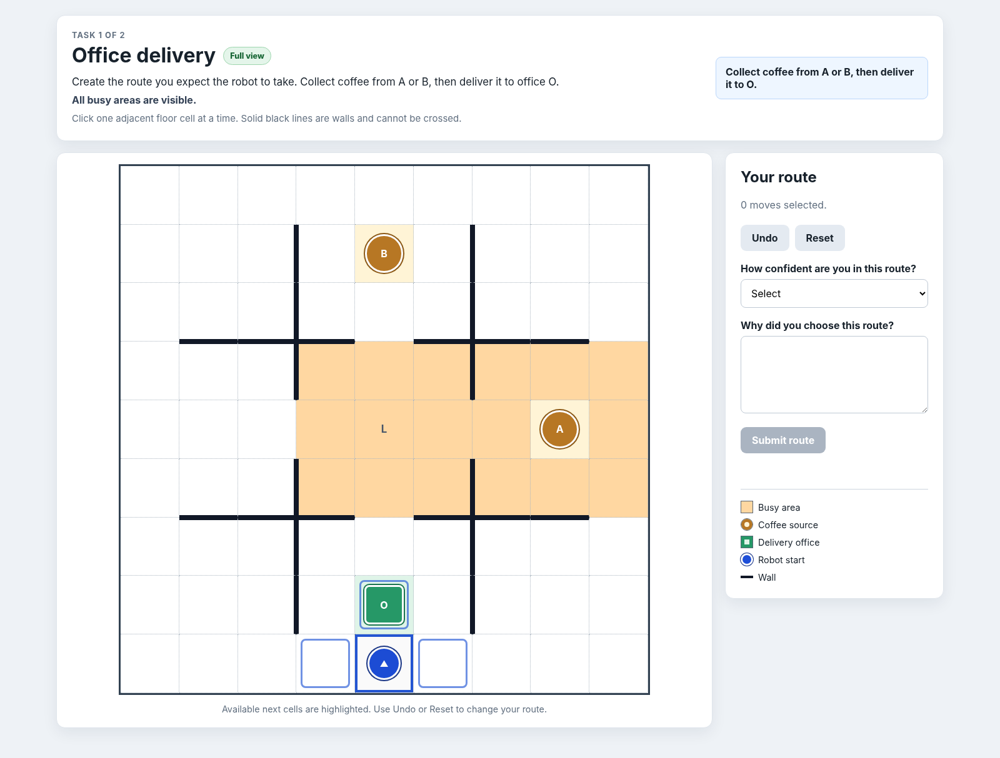
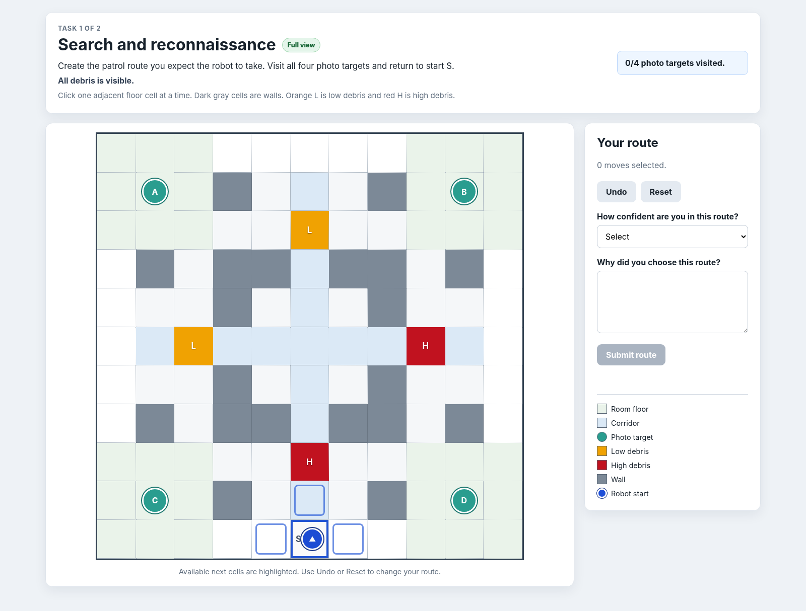

# SEP UPP User Study

This repository contains a working Flask application for Experiment 1 of the SEP UPP paper.

The study asks participants to construct the robot trajectory they expect under either full observability or partial observability. Each participant completes one OfficeWorld task and one Search and Reconnaissance task. The application records the trajectory, interaction history, response time, confidence, written explanation, final survey answers, and several reference reward values.

## 1. Current experiment design

Observability is assigned between participants.

Each participant is assigned exactly one condition:

1. Full observability
2. Partial observability

Each participant completes both domains:

1. OfficeWorld
2. Search and Reconnaissance

The order of the two domains is randomized for every participant.

This design prevents a participant from first seeing hidden information and later being asked to behave as though that information were unknown.

## 2. Participant flow

The implemented flow is:

1. Participant identifier page
2. Consent page
3. Quick attention check
4. Study instructions
5. First trajectory task
6. Second trajectory task
7. Final questionnaire
8. Completion page and completion code

The participant creates a route by clicking one valid adjacent cell at a time. The interface highlights valid next cells and provides Undo and Reset controls.

For every task, the participant also reports:

1. Confidence in the selected route
2. A written explanation of the route

## 3. Domain previews

### OfficeWorld



The OfficeWorld renderer contains:

1. White floor cells
2. Dotted grid boundaries
3. Solid black walls
4. Orange busy areas
5. Coffee sources A and B
6. Delivery office O
7. Robot start marker
8. Route arrows and current position

The full condition displays busy rooms A and L.

The partial condition displays only busy room L. Congestion in room A remains hidden from the participant.

### Search and Reconnaissance



The Search and Reconnaissance renderer contains:

1. Room floors
2. Corridors and hallway cells
3. Wall cells
4. Four photo targets
5. Low debris
6. High debris
7. Robot start marker
8. Route arrows and current position

The full condition displays every debris location.

The partial condition displays only detected debris. Hidden debris looks like ordinary floor.

Important: the Search and Reconnaissance coordinates in this package are still temporary study coordinates. Replace them with the exact coordinates from your paper environment before recruiting participants. Section 13 explains this process.

## 5. How route completion and hazards are handled

A Search and Reconnaissance route is accepted when the participant has:

1. Visited all four photo targets
2. Returned to the start cell S

The application does not reject a geometrically complete route merely because it enters high debris. This is intentional. Entering high debris is recorded as a failed true world execution, while the participant submission is still preserved for analysis. Otherwise the study would discard exactly the unsafe trajectories that partial observability may cause.

The saved score details include:

1. `route_completed`
2. `execution_success`
3. `stuck`
4. `first_high_step`
5. `hidden_hazard_entered`
6. `visible_high_hazard_entered`

This distinction is important when comparing full and partial observability conditions.

## 5. Project structure

```text
sep_upp_user_study/
    app.py
    requirements.txt
    .env.example
    README.md

    study/
        database.py
        domains.py
        scoring.py

    templates/
        base.html
        login.html
        consent.html
        instructions.html
        task.html
        survey.html
        complete.html

    static/
        css/
            style.css
        js/
            trajectory_builder.js

    analysis/
        compare_conditions.py

    tests/
        test_scoring.py

    docs/
        office_preview.png
        search_recon_preview.png

    data/

    export_csv.py
```

## 6. Requirements

Use Python 3.10 or newer.

The application currently depends on:

1. Flask
2. Gunicorn for production serving
3. SQLite, which is included with Python

## 7. Download and open the project

Unzip the package and enter the project directory.

```bash
unzip sep_upp_user_study_v2.zip
cd sep_upp_user_study
```

On Windows, extract the archive using File Explorer and open PowerShell inside the extracted `sep_upp_user_study` folder.

## 8. Create a virtual environment

### macOS or Linux

```bash
python3 -m venv .venv
source .venv/bin/activate
```

### Windows PowerShell

```powershell
py -m venv .venv
.venv\Scripts\Activate.ps1
```

After activation, the terminal usually shows `(.venv)` before the prompt.

## 9. Install dependencies

```bash
python -m pip install --upgrade pip
pip install -r requirements.txt
```

## 10. Run the application locally

The simplest command is:

```bash
python app.py
```

The application starts at:

```text
http://127.0.0.1:5001
```

Open that address in a browser.

The health check is available at:

```text
http://127.0.0.1:5001/health
```

A correct response is:

```json
{"ok": true}
```

## 11. Configure secrets and database location

The application reads configuration from environment variables.

The available variables are:

1. `SECRET_KEY`
2. `DATABASE_PATH`
3. `ADMIN_TOKEN`
4. `ALLOW_CONDITION_OVERRIDE`

The file `.env.example` lists example values, but the application does not automatically load that file. Set the variables in the terminal before starting the server.

### macOS or Linux

```bash
export SECRET_KEY="replace_with_a_long_random_value"
export DATABASE_PATH="data/study.sqlite3"
export ADMIN_TOKEN="replace_with_a_private_admin_token"
export ALLOW_CONDITION_OVERRIDE="1"
python app.py
```

### Windows PowerShell

```powershell
$env:SECRET_KEY="replace_with_a_long_random_value"
$env:DATABASE_PATH="data/study.sqlite3"
$env:ADMIN_TOKEN="replace_with_a_private_admin_token"
$env:ALLOW_CONDITION_OVERRIDE="1"
python app.py
```

Use a new strong secret and admin token before deployment.

## 12. Test the full and partial conditions

Condition override is intended only for development and pilot testing.

First enable it:

```bash
export ALLOW_CONDITION_OVERRIDE="1"
```

On Windows PowerShell:

```powershell
$env:ALLOW_CONDITION_OVERRIDE="1"
```

Start the server and open one of these addresses:

```text
http://127.0.0.1:5001/?condition=full
```

```text
http://127.0.0.1:5001/?condition=partial
```

Use a new participant identifier for every condition. An existing participant identifier keeps its original assigned condition.

For reliable testing, use separate private browser windows or clear the browser session between participants.

Before real data collection, disable override:

```bash
export ALLOW_CONDITION_OVERRIDE="0"
```

## 13. How condition assignment works

For normal recruitment, the application balances assignments automatically.

When a new participant is created, `study/database.py` counts the existing full and partial participants. The new participant is assigned to the condition with the smaller count. If the counts are equal, the application randomly chooses one condition.

The order of OfficeWorld and Search and Reconnaissance is independently randomized for that participant.

The assignment is stored permanently with the participant identifier.

## 14. Replace the Search and Reconnaissance placeholder with the exact world

Edit:

```text
study/domains.py
```

Replace these values using the output of your real `initialize_sr_world()` function:

1. `SEARCH_WALLS`
2. `SEARCH_TARGETS`
3. `SEARCH_TRUE_DEBRIS`
4. `SEARCH_DETECTED`
5. The grid size
6. The start location
7. The room cell definitions inside `_room_cells()`

The current format is:

```python
SEARCH_TARGETS = {
    "A": (1, 1),
    "B": (1, 9),
    "C": (9, 1),
    "D": (9, 9),
}

SEARCH_TRUE_DEBRIS = {
    (5, 2): "low",
    (5, 8): "high",
    (2, 5): "low",
    (8, 5): "high",
}

SEARCH_DETECTED = {
    (5, 2),
    (5, 8),
}
```

Interpretation:

1. `SEARCH_TRUE_DEBRIS` contains every real debris location.
2. `SEARCH_DETECTED` contains only debris visible in the partial condition.
3. The full condition displays every item in `SEARCH_TRUE_DEBRIS`.
4. The partial condition displays only locations that are also in `SEARCH_DETECTED`.

The scorer imports these same constants from `study/domains.py`. Therefore, updating the constants updates both the visual map and server scoring.

After editing the map, update the paths in `tests/test_scoring.py` so the tests use valid coordinates from the final environment.

## 15. Modify OfficeWorld

OfficeWorld configuration is also located in:

```text
study/domains.py
```

The important values are:

1. `ROOM_A`
2. `ROOM_L`
3. `OFFICE_BUSY_TRUE`
4. `office_blocked_edges()`
5. Start location
6. Coffee locations
7. Office location

The current version matches the uploaded OfficeWorld implementation.

If you modify the environment, update both `office_config()` and `score_office()` so the visual task and reward calculation stay consistent.

## 16. Edit study text

The page text is stored in the HTML templates.

Use these files:

```text
templates/consent.html
templates/instructions.html
templates/task.html
templates/survey.html
templates/complete.html
```

Before recruitment:

1. Replace the consent page with approved IRB language.
2. Add the study duration.
3. Add compensation information.
4. Add withdrawal and contact information.
5. Add the recruitment platform completion instructions.
6. Confirm that the wording does not reveal hidden hazards in the partial condition.

Domain specific instructions are stored in `office_config()` and `search_config()` inside `study/domains.py`.

## 17. Change visual appearance

The main styles are in:

```text
static/css/style.css
```

The interactive map logic is in:

```text
static/js/trajectory_builder.js
```

The JavaScript file controls:

1. Cell creation
2. Wall validation
3. Valid next cell highlighting
4. Route arrows
5. Undo and Reset
6. Completion checks
7. Interaction event recording
8. Submission to the server

The CSS file controls:

1. OfficeWorld floor and walls
2. Busy region appearance
3. Search room and corridor appearance
4. Debris markers
5. Photo targets
6. Route line appearance
7. Responsive page sizing

## 18. What is saved in the database

The default database is:

```text
data/study.sqlite3
```

The `participants` table stores:

1. Participant identifier
2. Assigned condition
3. Randomized domain order
4. Consent time
5. Start time
6. Completion time
7. Completion code

The `trials` table stores one row per domain:

1. Task index
2. Domain name
3. Assigned condition
4. Full trajectory as JSON
5. Every interaction event as JSON
6. Reward and safety scores as JSON
7. Response time in milliseconds
8. Confidence rating
9. Written explanation
10. Creation time

The `surveys` table stores the final questionnaire answers as JSON.

The `sanity_checks` table stores every attention check attempt:

1. The generated questions
2. The expected answers
3. The submitted answers
4. Whether the attempt passed
5. Whether the hidden honeypot field was filled
6. Response time in milliseconds
7. Attempt number and timestamps

The CSV export also includes `sanity_passed`, `sanity_attempts`, `sanity_honeypot_triggered`, `sanity_last_response_time_ms`, `sanity_min_response_time_ms`, and `sanity_any_very_fast`.

## 19. Interaction events

The browser records events such as:

1. Added trajectory point
2. Invalid click
3. Undo
4. Reset
5. Submission time

Each event includes elapsed time from the beginning of the task. This permits later analysis of hesitation, corrections, and route construction behavior.

## 20. Reward scores currently computed

Every submitted trajectory is evaluated under both full and partial reference rewards, regardless of the participant’s assigned condition.

The stored metrics are:

1. `task_reward`
2. `full_user_reward`
3. `partial_user_reward`
4. `true_safety_cost`
5. `perceived_safety_cost`
6. `hidden_hazard_entered`
7. `completed`
8. `steps`
9. Domain specific details

### OfficeWorld scoring

The task score currently uses:

1. Living reward of negative 0.1 per move
2. Coffee pickup reward of 5
3. Delivery reward of 10

The full user score penalizes congestion in both rooms A and L.

The partial user score penalizes only congestion visible in room L.

Both user scores reward collecting coffee from A and delivering it to O.

### Search and Reconnaissance scoring

The task score currently uses:

1. Living reward of negative 0.1
2. Photo reward of 5 per new target
3. Return to start reward of 10 after all photos
4. Additional effort penalty for low debris

The full user score evaluates all real debris.

The partial user score evaluates only detected debris.

Entering hidden high debris sets `hidden_hazard_entered` to true and causes the simulated robot to become stuck.

These are reference rewards for the study application. They do not replace the preference learned surrogate reward used in the paper. Keep the raw trajectories so they can later be used as demonstrations, preference data, or validation data for learned `u_H` models.

## 21. Run the tests

Run the scoring tests from the project root:

```bash
python -m unittest discover -s tests -v
```

The tests check:

1. A valid OfficeWorld coffee delivery
2. Detection of entry into hidden high debris

Run the tests again after changing any map coordinate or scoring rule.

## 21. Export the data to CSV

Stop the server or open a second terminal in the project directory.

Activate the same virtual environment and run:

```bash
python export_csv.py
```

The output is:

```text
data/sep_upp_user_study.csv
```

Each participant can contribute up to two trial rows, one for each domain.

The JSON fields remain inside CSV columns so no information is lost.

## 22. Run the included summary analysis

```bash
python analysis/compare_conditions.py data/sep_upp_user_study.csv
```

The script groups trials by domain and assigned condition, then reports mean:

1. Full user reward
2. Partial user reward
3. Task reward
4. True safety cost
5. Number of steps
6. Completion rate
7. Hidden hazard rate

This script is only an initial descriptive summary. The paper analysis should additionally include participant level statistical tests, domain order effects, confidence, response time, route features, and written explanation coding.

## 23. Download data through the browser

When the server is running, data can also be exported from:

```text
http://127.0.0.1:5001/admin/export.csv?token=YOUR_ADMIN_TOKEN
```

Replace `YOUR_ADMIN_TOKEN` with the value of `ADMIN_TOKEN`.

Do not share this address or token with participants.

## 24. Reset pilot data

Make a backup before deleting the database.

### macOS or Linux

```bash
cp data/study.sqlite3 data/study_backup.sqlite3
rm data/study.sqlite3
```

### Windows PowerShell

```powershell
Copy-Item data\study.sqlite3 data\study_backup.sqlite3
Remove-Item data\study.sqlite3
```

The next application start automatically creates a new empty database.

## 25. Production deployment

Use a production server instead of Flask debug mode.

A standard start command is:

```bash
gunicorn app:app
```

Set these production environment variables:

```text
SECRET_KEY
DATABASE_PATH
ADMIN_TOKEN
ALLOW_CONDITION_OVERRIDE=0
```

Important SQLite requirement:

The directory containing `DATABASE_PATH` must use persistent storage. Many cloud services erase their temporary file system during restart or deployment. If persistent storage is not configured, participant data can disappear.

For an initial study, use one of these approaches:

1. A university server or virtual machine with a persistent disk
2. A container host with a mounted persistent volume
3. A cloud application service with a persistent disk attached

Before opening recruitment:

1. Enable HTTPS.
2. Disable debug mode.
3. Set strong secrets.
4. Confirm database backups.
5. Test browser compatibility.
6. Test mobile and laptop layouts.
7. Confirm that condition override is disabled.
8. Confirm that hidden information never appears in partial trials.
9. Run the complete study from login to CSV export.

## 26. Recommended pilot procedure

Use at least a small pilot before formal recruitment.

For each condition:

1. Create several new participant identifiers.
2. Complete both domain orders.
3. Try Undo and Reset repeatedly.
4. Try clicking walls and nonadjacent cells.
5. Confirm that incomplete routes cannot be submitted.
6. Confirm the saved trajectory matches the displayed route.
7. Confirm confidence and explanation are exported.
8. Confirm full and partial maps differ only in intended information.
9. Ask pilot participants to explain every symbol in the legend.
10. Measure whether the tasks take the expected amount of time.

## 27. Recommended main outcome variables

For Experiment 1, useful dependent variables include:

1. Full user reward of the participant trajectory
2. Partial user reward of the participant trajectory
3. Difference between full and partial reward
4. True task reward
5. True safety cost
6. Perceived safety cost
7. Path length
8. Hidden hazard entry
9. Selected OfficeWorld coffee source
10. Search photo completion
11. Response time
12. Confidence
13. Number of Undo and Reset actions
14. Written route explanation

Because each participant completes both domains, account for repeated observations from the same participant during statistical analysis.

## 28. Common problems

### The browser says the port is already in use

Close the previous server process or change the port in the final line of `app.py`.

### Changes do not appear in the browser

Restart the Flask server and perform a hard refresh in the browser.

### The wrong condition appears

Use a new participant identifier. Existing identifiers retain their first assignment. Also confirm that the correct override address was used and that `ALLOW_CONDITION_OVERRIDE` equals 1.

### Search routes do not match the paper world

Replace the placeholder constants in `study/domains.py` with the exact Search and Reconnaissance environment values.

### A valid route is rejected after changing the map

Update the matching constants in `study/domains.py` and update `tests/test_scoring.py`. Confirm that scoring and rendering use the same start, walls, targets, and debris locations.

### No CSV rows appear

Complete and submit at least one trajectory. Then confirm that `DATABASE_PATH` points to the same database used by the running application.

### Participants cannot continue to the survey

The application requires two saved trials. Confirm that both domain routes were completed and submitted.

## 29. Files to freeze before data collection

Create a versioned release and do not change these files after formal recruitment begins:

1. `study/domains.py`
2. `study/scoring.py`
3. `templates/consent.html`
4. `templates/instructions.html`
5. `templates/task.html`
6. `templates/survey.html`
7. `static/js/trajectory_builder.js`
8. `static/css/style.css`

Also save the exact commit identifier, deployment configuration, and analysis plan.

## 30. Final checklist

Before recruitment, confirm all of the following:

1. IRB approved text is installed.
2. Exact OfficeWorld map is frozen.
3. Exact Search and Reconnaissance map is frozen.
4. Full and partial displays are correct.
5. Reward definitions are frozen.
6. Condition assignment is balanced.
7. Domain order randomization works.
8. Condition override is disabled.
9. HTTPS is enabled.
10. Database storage is persistent.
11. Database backup is tested.
12. Full study flow works on Chrome, Safari, Firefox, and Edge.
13. Exported rows contain trajectories, events, scores, confidence, explanations, and surveys.
14. Pilot participants understand every map symbol.
15. Analysis scripts run on the exported CSV.

## 31. Start again quickly

After the first installation, the normal local workflow is:

```bash
cd sep_upp_user_study
source .venv/bin/activate
python app.py
```

On Windows PowerShell:

```powershell
cd sep_upp_user_study
.venv\Scripts\Activate.ps1
python app.py
```

Then open:

```text
http://127.0.0.1:5001
```


## 32. Attention checks and basic bot screening

The study now includes a required attention check after consent and before the instructions. Participants must answer:

1. One randomly generated addition question
2. One question about the study task
3. One instructed response question

The page also includes a hidden honeypot input. Normal participants cannot see or select it. A basic form filling bot may fill it, causing the attempt to fail.

All attempts are saved in the `sanity_checks` table. Participants cannot open the task pages until at least one attempt passes. A failed attempt generates a new arithmetic question and allows another try.

Do not treat one signal as proof that a participant is a bot. Use the attention check together with route validity, completion time, explanation quality, duplicate participant identifiers, and repeated answer patterns.

### Files used by this feature

```text
app.py
study/database.py
templates/sanity.html
static/css/style.css
tests/test_sanity.py
```

### Update the hosted PythonAnywhere copy

First download a backup of:

```text
/home/YOUR_USERNAME/sep_upp_user_study/data/study.sqlite3
```

Then upload and replace only the files listed above. Do not replace the `data` folder.

After uploading the files, open the PythonAnywhere Web page and press Reload. The next application start automatically creates the new `sanity_checks` table inside the existing database. Existing participant and trajectory records remain unchanged.

Test with a new participant identifier. The expected flow is consent, attention check, instructions, and then the two route tasks.
